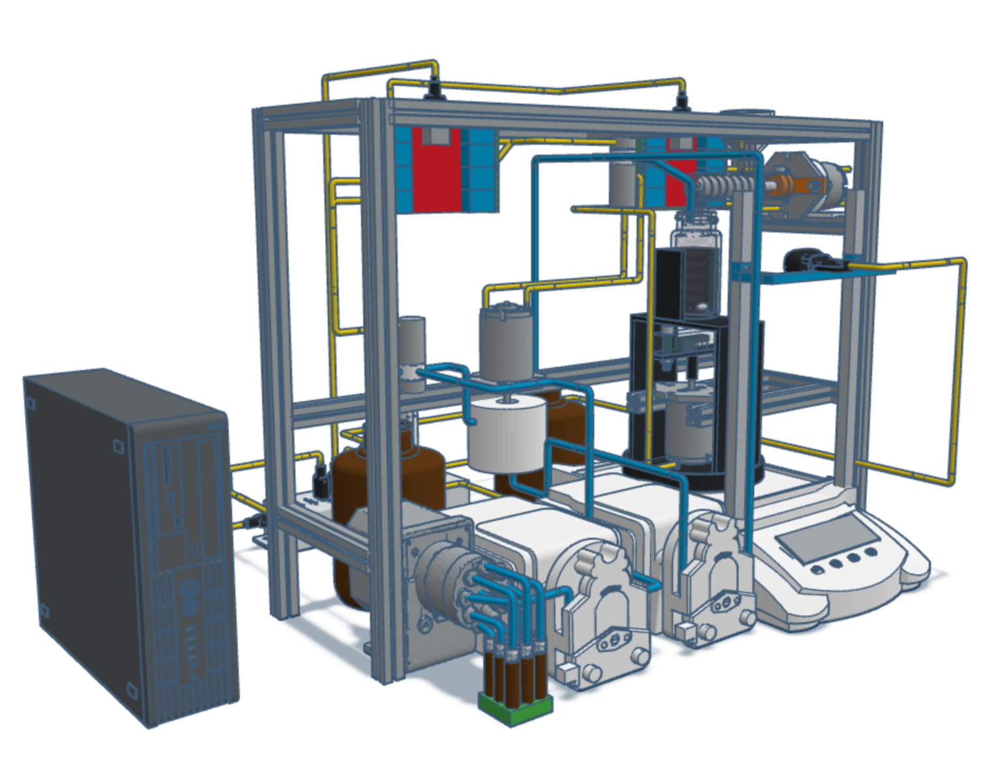
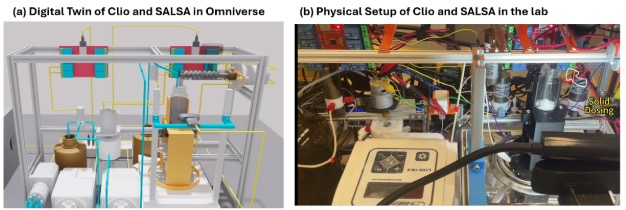

## 🌶️💃 SALSA (SALt Solubility Asseseement) Overview

### 💡 Description
This CAD design, created in **Tinkercad**, illustrates the SALSA system layout.  
Click the "View on Tinkercad" badge above to download and explore the interactive 3D model directly in Tinkercad.

### 💡 Digital Twins

In addition to CAD file, we also create an Omniverse digital twin for SALSA
Omniverse Example: (a) Digital Twin of Clio and SALSA in Omniverse (b) Physical Setup of Clio and SALSA in the lab 

### 📂 Download
Subcomponents of SALSA can be downloaded in the SALSA CAD folder in the form of STL file.

### 💻 Code
Computer vision models related codes can be found at CV model files.
Pipeline related codes can be found at Pipeline files.
