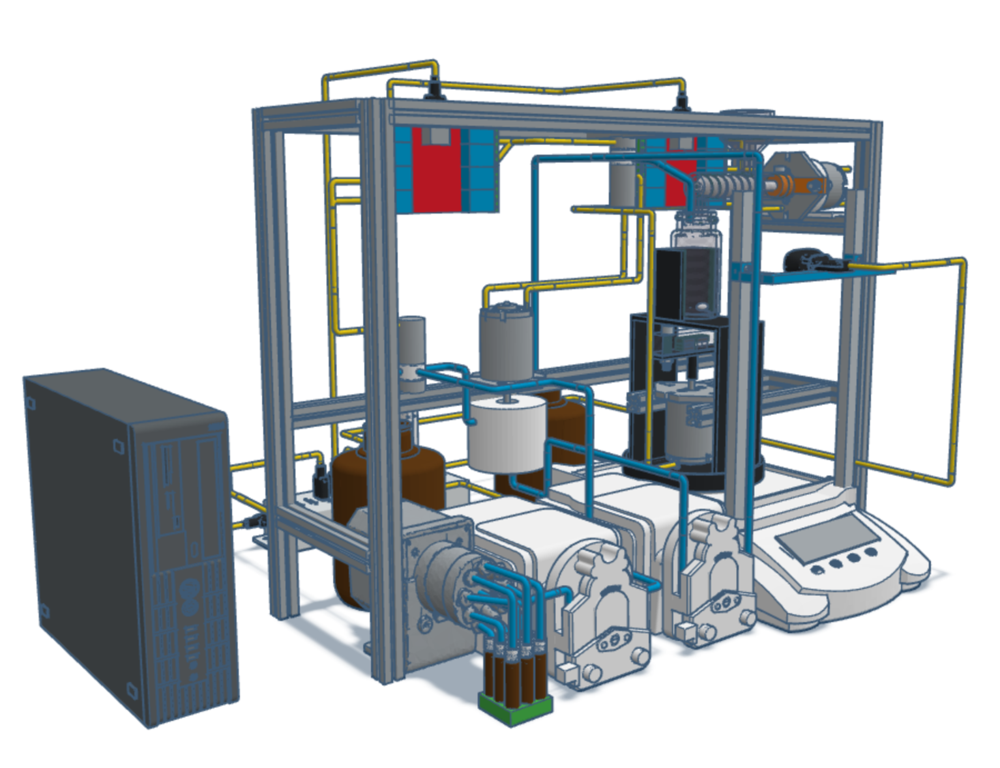
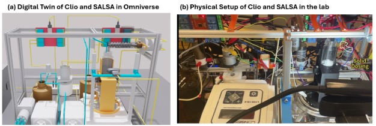

## 🌶️💃 SALSA (SALt Solubility Assessment) Overview

### 💡 Description
This CAD design, created in **Tinkercad**, illustrates the SALSA system layout.  
Click the "View on Tinkercad" badge above to download and explore the interactive 3D model directly in Tinkercad.

### 💡 Digital Twins

In addition to CAD file, we also create an Omniverse digital twin for SALSA.  

Left: digital twin of SALSA in Omniverse  
Right: physical setup of SALSA in the lab 

### 📂 Download
Subcomponents of SALSA can be downloaded in the [SALSA CAD](SALSA%20CAD/) folder in the form of STL file.

### 💻 Code
Computer vision models related codes can be found at [CV model files](CV%20model%20files/) folder.  
Pipeline related codes can be found at [Pipeline files](Pipeline%20files/) folder.

### 📊 CSV Data
All experimental data used in this study are available in the CSV file: [NaFSI.csv](NaFSI.csv)  
This file includes columns for experiment ID, temperature in degree celsius, date of experiment, mass percentage of solvent(s) used in %, and solubility value in grams per 100 grams of solvent.  

### 🎥 Video Demo
A 1-minute video demonstration of the system is provided in [SALSA Demo Video.mp4](SALSA%20Demo%20Video.mp4)  
Also, a quick Omniverse digital twin demonstration video can ba found at [Omniverse.mp4](Omniverse.mp4)

### 📄 Publication
Our work is published on ChemRxiv:  
🔗 [https://pubs.rsc.org/en/content/articlelanding/2026/dd/d5dd00516g](https://pubs.rsc.org/en/content/articlelanding/2026/dd/d5dd00516g)
